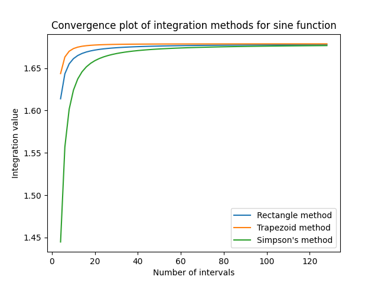

# Numerical Integration Methods

This Python script demonstrates the implementation and comparison of various numerical integration methods: rectangle method, trapezoid method, and Simpson's method. The functions to be integrated are predefined mathematical functions, including sine function, quadratic function, and exponential function.

## Functions

### Sin Function

The sine function is defined as:

    f(x) = sin(x)

### Quadratic Function

The quadratic function is defined as:

    f(x) = x^2 + 2x + 5

### Exponential Function

The exponential function is defined as:

    f(x) = exp(x)

## Results

The integration interval for all functions is from 0.5 to 5, and the number of intervals varies from 4 to 128 with an increment of 2. Here are the results obtained using different integration methods:

- **Sin Function**
  - Number of intervals: 4
    - Rectangle method: 1.6138444684209179
    - Trapezoid method: 1.643606119795856
    - Simpson's method: 1.4447536255261637

- **Quadratic Function**
  - Number of intervals: 4
    - Rectangle method: 70.83984375
    - Trapezoid method: 89.82421875
    - Simpson's method: 61.98046875

- **Exponential Function**
  - Number of intervals: 4
    - Rectangle method: 79.3715292935631
    - Trapezoid method: 161.92652557399362
    - Simpson's method: 86.01904915019628

## Convergence Plots

Below are the convergence plots for each function, showing how the integration value changes with the number of intervals for each integration method.

### Sin Function Convergence Plot

### Quadratic Function Convergence Plot

### Exponential Function Convergence Plot

## Technologies

- Python
- Integrals Methods
- File Handling
- Matplotlib

## Author

This project was created by [Maksymilian Kubiczek] ([@MaksKubiczek](https://github.com/MaksKubiczek)).

## License

This project is licensed under the [MIT License]. For more information, see the LICENSE file.
