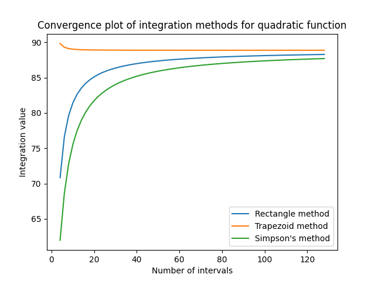
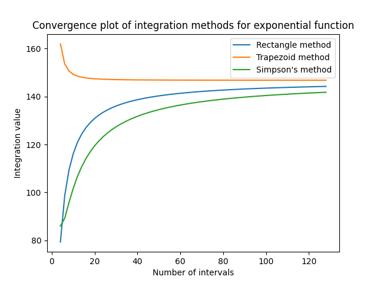

# Metody Numerycznego Całkowania

Ten skrypt w języku Python demonstruje implementację i porównanie różnych metod numerycznego całkowania: metoda prostokątów, metoda trapezów i metoda Simpsona. Funkcje do całkowania są z góry zdefiniowanymi funkcjami matematycznymi, obejmującymi funkcję sinus, funkcję kwadratową i funkcję wykładniczą.

## Funkcje

### Funkcja Sinus

Funkcja sinus jest zdefiniowana jako:

  f(x) = sin(x)

### Funkcja Kwadratowa

Funkcja kwadratowa jest zdefiniowana jako:

  f(x) = x^2 + 2x + 5

### Funkcja Wykładnicza

Funkcja wykładnicza jest zdefiniowana jako:

  f(x) = exp(x)

## Wyniki

Przedział całkowania dla wszystkich funkcji wynosi od 0.5 do 5, a liczba przedziałów zmienia się od 4 do 128 z krokiem 2. Oto wyniki uzyskane za pomocą różnych metod całkowania:

- **Funkcja Sinus**
  - Liczba przedziałów: 4
    - Metoda prostokątów: 1.6138444684209179
    - Metoda trapezów: 1.643606119795856
    - Metoda Simpsona: 1.4447536255261637

- **Funkcja Kwadratowa**
  - Liczba przedziałów: 4
    - Metoda prostokątów: 70.83984375
    - Metoda trapezów: 89.82421875
    - Metoda Simpsona: 61.98046875

- **Funkcja Wykładnicza**
  - Liczba przedziałów: 4
    - Metoda prostokątów: 79.3715292935631
    - Metoda trapezów: 161.92652557399362
    - Metoda Simpsona: 86.01904915019628

## Wykresy Zbieżności

Poniżej przedstawione są wykresy zbieżności dla każdej funkcji, pokazujące jak wartość całki zmienia się wraz z liczbą przedziałów dla każdej metody całkowania.

### Wykres Zbieżności Funkcji Sinus

 

### Wykres Zbieżności Funkcji Kwadratowej

 

### Wykres Zbieżności Funkcji Wykładniczej

 

## Technologie

- Python
- Metody Całkowania
- Obsługa Plików
- Matplotlib

## Autor

Ten projekt został stworzony przez ([MaksKubiczek](https://github.com/MaksKubiczek)).

## Licencja

Ten projekt jest licencjonowany na podstawie [Licencji MIT]. Aby uzyskać więcej informacji, zobacz plik LICENSE.
