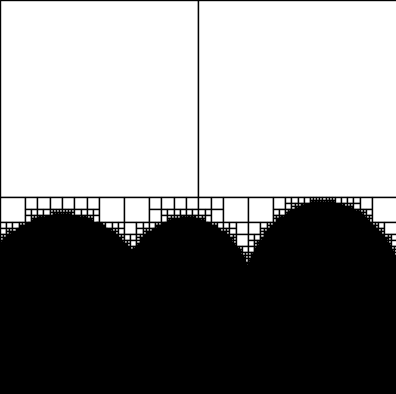

# Project: QuadTree Visualization

## Description

This project aims to visualize the structure of a two-color image using a QuadTree. A QuadTree is a data structure used in computer graphics to hierarchically partition areas into smaller squares (or rectangles) that can be homogeneous based on certain criteria, such as pixel color. In this project, the input image is processed, and then a QuadTree is constructed, representing the structure of the image. As a result, we obtain a visualization of the QuadTree, where homogeneous regions are represented by uniform rectangles, and complex regions are divided into smaller areas.

## Files

1. **main.py**: The main file of the project, containing code to load the input image, process it, and generate a QuadTree visualization. It utilizes the PIL (Python Imaging Library) for image manipulation and matplotlib for visualization generation.

2. **bg.jpg**: The input image in JPEG format, which will be processed by the project. This image contains a two-color pattern that will undergo analysis.

    

3. **quadtree_visualization.png**: The output image in PNG format, which contains the QuadTree visualization. The visualization depicts areas of the image divided into smaller regions based on the homogeneity criterion.

    

## How to Run

To run the project, execute the `main.py` file using a Python interpreter. After processing the input image, a QuadTree visualization will be generated and saved as the `quadtree_visualization.png` file.

```bash
python main.py

```

## Author

This project was created by [Maksymilian Kubiczek]([@MaksKubiczek](https://github.com/MaksKubiczek)).

## License

This project is licensed under the [MIT License]. For more information, see the LICENSE file.
