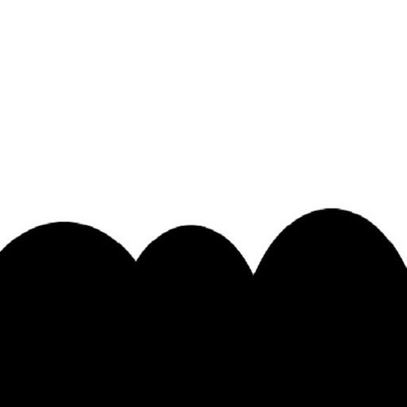

# Projekt: Wizualizacja drzewa QuadTree

## Opis

Projekt ten ma na celu wizualizację struktury dwukolorowego obrazu za pomocą drzewa QuadTree. Drzewo QuadTree jest strukturą danych stosowaną w grafice komputerowej do hierarchicznego podziału obszarów na mniejsze kwadraty (lub prostokąty), które mogą być jednorodne pod względem pewnych kryteriów, takich jak kolor pikseli. W tym projekcie obraz wejściowy jest przetwarzany, a następnie tworzone jest drzewo QuadTree, które reprezentuje strukturę obrazu. W rezultacie otrzymujemy wizualizację drzewa QuadTree, gdzie obszary jednorodne są reprezentowane przez jednolitne prostokąty, a obszary złożone są podzielone na mniejsze obszary.

## Pliki

1. **main.py**: Plik główny projektu, zawiera kod do wczytania obrazu wejściowego, przetworzenia go i wygenerowania wizualizacji drzewa QuadTree. Wykorzystuje biblioteki PIL (Python Imaging Library) do manipulacji obrazami oraz matplotlib do generowania wizualizacji.

2. **bg.jpg**: Obraz wejściowy w formacie JPEG, który zostanie przetworzony przez projekt. Obraz ten zawiera dwukolorowy wzór, który zostanie poddany analizie.

    

3. **quadtree_visualization.png**: Obraz wyjściowy w formacie PNG, który zawiera wizualizację drzewa QuadTree. Wizualizacja przedstawia obszary obrazu, które zostały podzielone na mniejsze obszary w zależności od kryterium jednorodności.

    

## Uruchomienie

Aby uruchomić projekt, należy uruchomić plik `main.py` za pomocą interpretera Pythona. Po przetworzeniu obrazu wejściowego zostanie wygenerowana wizualizacja drzewa QuadTree, która zostanie zapisana jako plik `quadtree_visualization.png`.

```bash
python main.py

```

## Autor

Ten projekt został stworzony przez ([MaksKubiczek](https://github.com/MaksKubiczek)).

## Licencja

Ten projekt jest objęty licencją [MIT]. Więcej informacji znajduje się w pliku LICENSE.